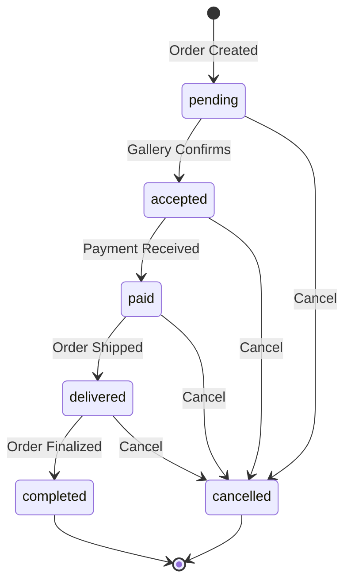

# Order Lifecycle Management

## Overview

This document describes the complete order lifecycle management system implemented in the Galleries Manager application.

## Order Status Flow



## Order Statuses

| Status | Description | Next Possible States |
|--------|-------------|---------------------|
| `pending` | Order created, awaiting gallery confirmation | `accepted`, `cancelled` |
| `accepted` | Gallery confirmed the order | `paid`, `cancelled` |
| `paid` | Payment received | `delivered`, `cancelled` |
| `delivered` | Order shipped/delivered to customer | `completed`, `cancelled` |
| `completed` | Order finalized (terminal state) | None |
| `cancelled` | Order cancelled (terminal state) | None |

## API Endpoints

### 1. Create Order
- **Endpoint**: `POST /api/v1/orders`
- **Access**: User only
- **Description**: User checks out items from a specific gallery

### 2. Get Orders
- **Endpoint**: `GET /api/v1/orders`
- **Access**: All authenticated users (role-based filtering)
- **Behavior**:
  - **User**: See only their own orders
  - **Gallery Owner**: See all orders for their gallery
  - **Employee**: See all orders for their gallery
  - **Admin**: See all orders in database

### 3. Get Single Order
- **Endpoint**: `GET /api/v1/orders/:id`
- **Access**: Order owner, gallery members, or admin
- **Description**: View details of a specific order

### 4. Confirm Order (Accept Pending Order)
- **Endpoint**: `PATCH /api/v1/orders/:id`
- **Access**: Gallery Owner, Employee, Admin
- **Description**: Accept a pending order (transitions from `pending` to `accepted`)
- **Validation**: Only pending orders can be confirmed

### 5. Update Order Status
- **Endpoint**: `PATCH /api/v1/orders/:id/status`
- **Access**: Gallery Owner, Admin only
- **Body**: `{ "status": "paid" | "delivered" | "completed" }`
- **Description**: Update order to any valid next state
- **Validation**: Status transitions must follow the defined flow

### 6. Cancel Order
- **Endpoint**: `PATCH /api/v1/orders/:id/cancel`
- **Access**: Order owner, Gallery Owner, Admin
- **Description**: Cancel an order at any valid stage
- **Side Effect**: Restores product stock for all items
- **Validation**: Cannot cancel orders in `completed` or `cancelled` state

## Status Transition Rules

The system enforces strict status transition rules to maintain data integrity:

```javascript
ORDER_TRANSITIONS = {
  pending: ['accepted', 'cancelled'],
  accepted: ['paid', 'cancelled'],
  paid: ['delivered', 'cancelled'],
  delivered: ['completed', 'cancelled'],
  completed: [], // Terminal state
  cancelled: [], // Terminal state
}
```

### Examples:

✅ **Valid Transitions**:
- `pending` → `accepted` (Gallery confirms order)
- `accepted` → `paid` (Payment received)
- `paid` → `delivered` (Order shipped)
- `delivered` → `completed` (Order finalized)
- Any non-terminal state → `cancelled`

❌ **Invalid Transitions**:
- `pending` → `paid` (Must go through `accepted` first)
- `completed` → `cancelled` (Cannot cancel completed orders)
- `cancelled` → `accepted` (Cannot reactivate cancelled orders)

## Implementation Details

### Files Structure

```
src/modules/orders/
├── order.constants.js      # Status definitions and transitions
├── order.controller.js     # Request handlers
├── order.routes.js         # Route definitions
├── order.service.js        # Business logic
└── order.validation.js     # Request validation
```

### Key Components

#### 1. Order Constants (`order.constants.js`)
- Defines all order statuses
- Defines valid status transitions
- Single source of truth for order lifecycle

#### 2. Order Service (`order.service.js`)
- `getOrders(user)` - Role-based order filtering
- `confirmOrder(orderId)` - Accept pending order
- `updateOrderStatus(orderId, status)` - Update to any valid state
- `cancelOrder(orderId, cancelledBy)` - Cancel with stock restoration

#### 3. Order Controller (`order.controller.js`)
- Handles HTTP requests/responses
- Delegates business logic to service layer
- Returns appropriate status codes and messages

#### 4. Order Validation (`order.validation.js`)
- Validates request parameters and body
- Ensures status values are valid
- Loads order and attaches to request

#### 5. Order Routes (`order.routes.js`)
- Defines all order endpoints
- Applies authentication and authorization
- Chains middleware in correct order

## Stock Management

### Stock Deduction
When an order is created:
- Stock is decremented atomically for each product
- Transaction ensures consistency
- Fails if insufficient stock

### Stock Restoration
When an order is cancelled:
- Stock is restored for all order items
- Done in a transaction
- Ensures data consistency

## Security & Access Control

### Authentication
All order endpoints require authentication via JWT token.

### Authorization

| Endpoint | User | Gallery Owner | Employee | Admin |
|----------|------|---------------|----------|-------|
| Create Order | ✅ | ❌ | ❌ | ❌ |
| Get Orders | ✅ (own) | ✅ (gallery) | ✅ (gallery) | ✅ (all) |
| Get Order | ✅ (own) | ✅ (gallery) | ✅ (gallery) | ✅ |
| Confirm Order | ❌ | ✅ | ✅ | ✅ |
| Update Status | ❌ | ✅ | ❌ | ✅ |
| Cancel Order | ✅ (own) | ✅ (gallery) | ❌ | ✅ |

## Error Handling

The system provides clear error messages for invalid operations:

- **400 Bad Request**: Invalid status transition
- **401 Unauthorized**: Missing or invalid authentication
- **403 Forbidden**: Insufficient permissions
- **404 Not Found**: Order not found

## Example Usage

### Gallery Owner Workflow

1. **View Gallery Orders**
   ```bash
   GET /api/v1/orders
   Authorization: Bearer <token>
   ```

2. **Accept Pending Order**
   ```bash
   PATCH /api/v1/orders/:id
   Authorization: Bearer <token>
   ```

3. **Mark as Paid**
   ```bash
   PATCH /api/v1/orders/:id/status
   Authorization: Bearer <token>
   Body: { "status": "paid" }
   ```

4. **Mark as Delivered**
   ```bash
   PATCH /api/v1/orders/:id/status
   Authorization: Bearer <token>
   Body: { "status": "delivered" }
   ```

5. **Complete Order**
   ```bash
   PATCH /api/v1/orders/:id/status
   Authorization: Bearer <token>
   Body: { "status": "completed" }
   ```

### User Workflow

1. **Create Order**
   ```bash
   POST /api/v1/orders
   Authorization: Bearer <token>
   Body: { "galleryId": "...", "shippingAddress": {...} }
   ```

2. **View Own Orders**
   ```bash
   GET /api/v1/orders
   Authorization: Bearer <token>
   ```

3. **Cancel Order (if needed)**
   ```bash
   PATCH /api/v1/orders/:id/cancel
   Authorization: Bearer <token>
   ```

## Best Practices

1. **Always validate status transitions** - Use the service layer methods
2. **Handle errors gracefully** - Provide clear error messages
3. **Use transactions** - Ensure data consistency for multi-step operations
4. **Log important events** - Track order status changes
5. **Test edge cases** - Verify all transition scenarios

## Future Enhancements

Potential improvements:
- Add email notifications for status changes
- Implement order tracking numbers
- Add refund functionality for cancelled orders
- Support partial order cancellation
- Add order notes/comments history
